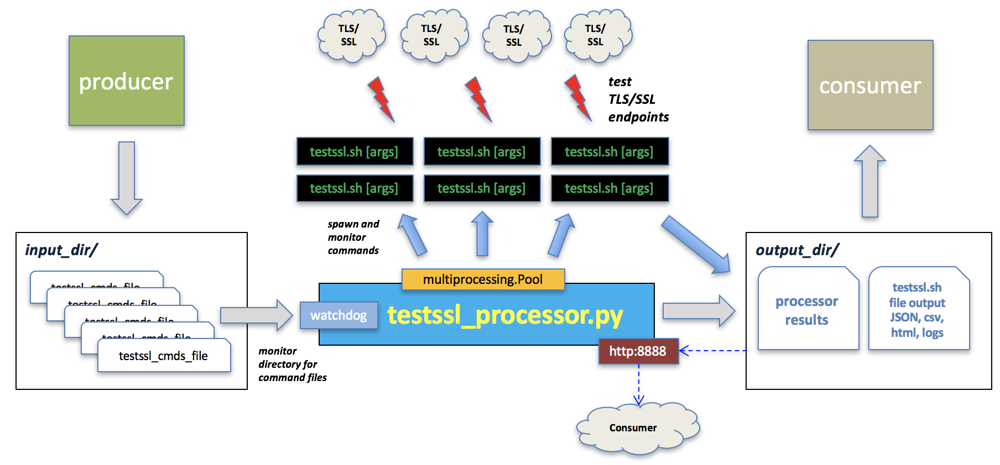
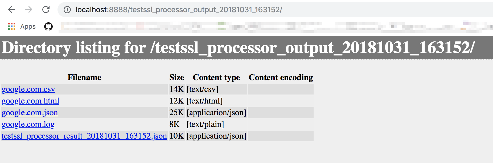

# testssl.sh-processor

This project is intended to serve as part of a larger pipeline for mass concurrent invocations of the great SSL/TLS
testing tool https://github.com/drwetter/testssl.sh via command files.

See the sibling project [testssl.sh-alerts](https://github.com/bitsofinfo/testssl.sh-alerts) for a engine that can react to `testssl.sh` JSON result output files to send notifications or perform other actions.



## testssl_processor.py

Provides a long lived watchdog process that monitors a directory (via [watchdog](https://github.com/gorakhargosh/watchdog))
for `testssl.sh` command files. As new files appear within the `--input-dir` containing the `--filename-filter`
they are consumed and evaluated for `testssl.sh` commands, one per line. Each `testssl.sh` command is processed in a separate thread and processing results are logged to a YAML or JSON result file under the `--output-dir`. The actual output from each invoked `testssl.sh` invocation (i.e. via `--*file` arguments) is also written to disk scoped within a timestamped output directory under the `--output-dir`

# Requirements

**Python 3**

Dependencies:
```
pip install twisted pyyaml python-dateutil watchdog
```

# Usage

```bash
./testssl_processor.py --help                                                                                       

usage: testssl_processor.py [-h] [-i INPUT_DIR] [-O OUTPUT_DIR]
                            [-m TESTSSL_PATH_IF_MISSING] [-f FILENAME_FILTER]
                            [-o RESULT_FILENAME_PREFIX] [-q RESULT_FORMAT]
                            [-l LOG_FILE] [-x LOG_LEVEL] [-w WATCHDOG_THREADS]
                            [-t TESTSSL_THREADS]
                            [-W OUTPUT_DIR_HTTPSERVER_PORT]
                            [-u RETAIN_OUTPUT_DAYS]

optional arguments:
  -h, --help            show this help message and exit
  -i INPUT_DIR, --input-dir INPUT_DIR
                        Directory path to recursively monitor for new
                        `--filename-filter` testssl.sh command files. Default
                        './input'
  -O OUTPUT_DIR, --output-dir OUTPUT_DIR
                        Directory path to place all processor output, and
                        testssl.sh output files to if relative paths are in
                        command files. If absoluate paths are in testssl.sh
                        command files they will be respected and only
                        processor output will go into --output-dir. Default
                        './output'
  -m TESTSSL_PATH_IF_MISSING, --testssl-path-if-missing TESTSSL_PATH_IF_MISSING
                        If the testssl.sh commands in the command files do not
                        reference an absolute path to the testssl.sh command,
                        it assumes its already on the PATH or in the current
                        working directory of the processor. Otherwise you can
                        specify the PATH to it with this argument. Default
                        './testssl.sh'
  -f FILENAME_FILTER, --filename-filter FILENAME_FILTER
                        Only react to filenames in --input-dir that contain
                        the string --filename-filter, default 'testssl_cmds'
  -o RESULT_FILENAME_PREFIX, --result-filename-prefix RESULT_FILENAME_PREFIX
                        processor execution result filename prefix. Default
                        'testssl_processor_result'
  -q RESULT_FORMAT, --result-format RESULT_FORMAT
                        processor result filename format, json or yaml.
                        Default 'json'
  -l LOG_FILE, --log-file LOG_FILE
                        Path to log file, default None which means STDOUT
  -x LOG_LEVEL, --log-level LOG_LEVEL
                        log level, default DEBUG
  -w WATCHDOG_THREADS, --watchdog-threads WATCHDOG_THREADS
                        max threads for watchdog file processing, default 1
  -t TESTSSL_THREADS, --testssl-threads TESTSSL_THREADS
                        for each watchdog file event, the maximum number of
                        commands to be processed concurrently by testssl.sh
                        invocations, default 5
  -W OUTPUT_DIR_HTTPSERVER_PORT, --output-dir-httpserver-port OUTPUT_DIR_HTTPSERVER_PORT
                        Default None, if a numeric port is specified, this
                        will startup a simple twisted http server who's
                        document root is the --output-dir
  -u RETAIN_OUTPUT_DAYS, --retain-output-days RETAIN_OUTPUT_DAYS
                        Optional, default 7, the number of days of data to
                        retain that ends up under `--output-dir`, purges
                        output dirs older than this time threshold
```

# Docker
```
docker build -t testssl-processor .

docker run \
  -v /pathto/input:/input -v /pathto/output:/output \
  testssl-processor:latest \
  testssl_processor.py \
    --input-dir /input \
    --output-dir /output \
    --output-dir-httpserver-port 8888 \
    --testssl-threads 5 \
    --retain-output-days .1
```

## Example:

Run the command:
```
git clone https://github.com/drwetter/testssl.sh

mkdir input
mkdir output

./testssl_processor.py \
  --input-dir ./input \
  --testssl-path-if-missing ./testssl.sh \
  --output-dir ./output \
  --filename-filter testssl_cmds \
  --result-format json \
  --output-dir-httpserver-port 8888
```

Given a `testssl_cmds` file (see `sample/` dir) dropped into directory `input/`.

```
cp sample/www.google.com-testssl_cmds input/
```

Now the `testssl_processor.py` output shows:

```
2018-11-13 19:49:10,022 - root - INFO - Monitoring for new testssl_cmds files at: ./input with filename filter: testssl_cmds
2018-11-13 19:49:10,023 - root - INFO - Starting HTTP server listening on: 8888 and serving up: ./output
2018-11-13 19:49:12,311 - root - INFO - Responding to creation of file: ./input/www.google.com-testssl_cmds
2018-11-13 19:49:17,317 - root - INFO - Processing testssl_cmds: './input/www.google.com-testssl_cmds'
2018-11-13 19:49:17,340 - root - INFO - Processing testssl_cmd: 'testssl.sh -S -P -p --fast --logfile www.google.com/20181108120000/public/search/20181108120000_testssl_www.google.com.log --jsonfile-pretty www.google.com/20181108120000/public/search/20181108120000_testssl_www.google.com.json --csvfile www.google.com/20181108120000/public/search/20181108120000_testssl_www.google.com.csv --htmlfile www.google.com/20181108120000/public/search/20181108120000_testssl_www.google.com.html https://www.google.com'
making dir: ./output/20181113_194917-www.google.com-testssl_cmds/www.google.com/20181108120000/public/search
2018-11-13 19:50:03,392 - root - DEBUG - Command finished: exit code: 0 stdout.len:5752 stderr.len:0 cmd: /Users/inter0p/Documents/omg/code/github.com/bitsofinfo/testssl.sh-processor/testssl.sh/testssl.sh -S -P -p --fast --logfile www.google.com/20181108120000/public/search/20181108120000_testssl_www.google.com.log --jsonfile-pretty www.google.com/20181108120000/public/search/20181108120000_testssl_www.google.com.json --csvfile www.google.com/20181108120000/public/search/20181108120000_testssl_www.google.com.csv --htmlfile www.google.com/20181108120000/public/search/20181108120000_testssl_www.google.com.html https://www.google.com
2018-11-13 19:50:03,394 - root - DEBUG - Event 20181113_194917 Testssl processor result written to: ./output/20181113_194917-www.google.com-testssl_cmds/testssl_processor_result_20181113_194917.json
2018-11-13 19:50:03,495 - root - DEBUG - Pool closed and terminated
```

The contents of our `input/` and `output/` dirs is now as follows.
The actual output of the `testssl.sh` commands `--*file` directives are in the respective html/json files etc, while the output from the processor itself that invokes all the `testssl.sh` commands is in the `testssl_processor_result_*.json` files.


Contents of `testssl_processor_result_*.json`:

```
[
    {
        "success": true,
        "orig_cmd": "testssl.sh -S -P -p --fast --logfile www.google.com/20181108120000/public/search/20181108120000_testssl_www.google.com.log --jsonfile-pretty www.google.com/20181108120000/public/search/20181108120000_testssl_www.google.com.json --csvfile www.google.com/20181108120000/public/search/20181108120000_testssl_www.google.com.csv --htmlfile www.google.com/20181108120000/public/search/20181108120000_testssl_www.google.com.html https://www.google.com",
        "timestamp": "20181113_194917",
        "testssl_path_if_missing": "./testssl.sh",
        "actual_cmd": "/home/bitsofinfo/testssl.sh-processor/testssl.sh/testssl.sh -S -P -p --fast --logfile www.google.com/20181108120000/public/search/20181108120000_testssl_www.google.com.log --jsonfile-pretty www.google.com/20181108120000/public/search/20181108120000_testssl_www.google.com.json --csvfile www.google.com/20181108120000/public/search/20181108120000_testssl_www.google.com.csv --htmlfile www.google.com/20181108120000/public/search/20181108120000_testssl_www.google.com.html https://www.google.com",
        "cwd": "./output/20181113_194917-www.google.com-testssl_cmds",
        "returncode": 0,
        "stdout": "\u001b[1m\n###########################################################\n    testssl.sh       3.0rc2 from \u001b[m\u001b[1mhttps://testssl.sh/dev/.................. ... .. . .172.217.6.68:443 (www.google.com) <<--\u001b[m\n\n\n",
        "stderr": "",
        "exec_ms": 46051.146
    }
]
```

Hitting http://localhost:8888 in a browser:



## Related

* If you would like to react and send alerts or copy files around based on the results of the `testssl.sh` JSON result file output produced by this, take a look at [testssl.sh-alerts](https://github.com/bitsofinfo/testssl.sh-alerts) at https://github.com/bitsofinfo/testssl.sh-alerts

* This tool was originally developed to consume `testssl.sh` command files generated as part of the [swarm-traefik-state-analyzer](https://github.com/bitsofinfo/swarm-traefik-state-analyzer/blob/master/docs/tlsssltools.md) project's [testsslcmdsgeneratory.py](https://github.com/bitsofinfo/swarm-traefik-state-analyzer/blob/master/docs/tlsssltools.md) script as part of a larger pipeline of scripts that continously monitors the state of applications deployed on Docker Swarm clusters.

* You can also use [testssl.sh-masscan's generate_scan_file.py](https://github.com/TKCERT/testssl.sh-masscan/blob/master/generate_scan_file.py) to generate command files that are compatible with the `testssl_processor.py` watchdog processor
