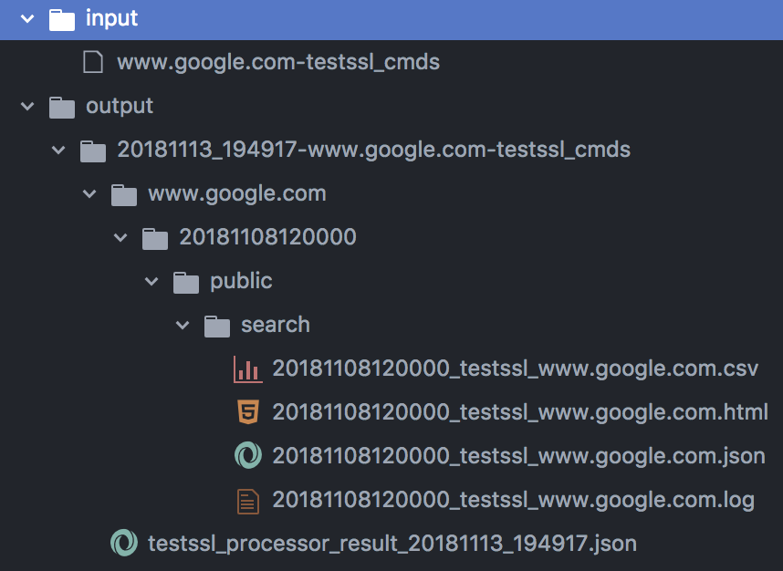
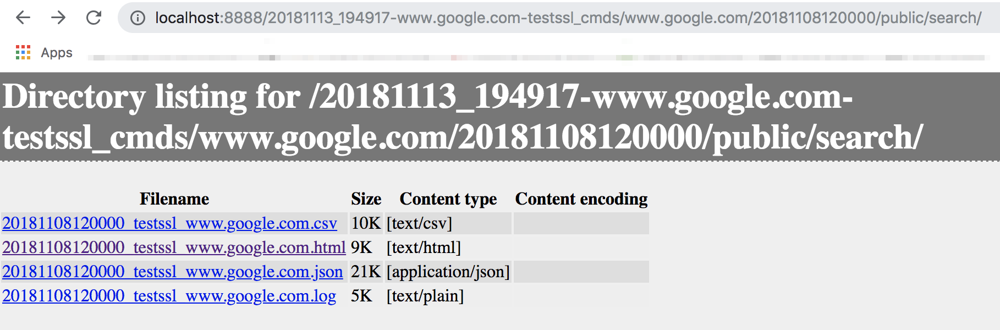

# testssl.sh-processor

This project is intended to provide mass concurrent invocations of the great SSL/TLS
testing tool https://github.com/drwetter/testssl.sh via command files.

## testssl_processor.py

Provides a long lived watchdog process that monitors a directory (via [watchdog](https://github.com/gorakhargosh/watchdog))
for `testssl.sh` command files. As new files appear within the `--input-dir` containing the `--filename-filter`
they are consumed and evaluated for `testssl.sh` commands, one per line. Each `testssl.sh` command is processed in a separate thread and processing results are logged to a YAML or JSON result file under the `--output-dir`. The actual output from each invoked `testssl.sh` invocation (i.e. via `--*file` arguments) is also written to disk scoped within a timestamped output directory under the `--output-dir`

```bash
./testssl.sh-processor.py \
  --input-dir [input dir to watch] \
  --output-dir [output dir]
  --job-name [optional name for this execution job] \
  --filename-filter [only react to names matching this] \
  --result-filename-prefix [prefix to prepend to processor result output files] \
  --result-format [json | yaml] \
  --watchdog_threads [N] \
  --testssl_threads [N] \
  --output-dir-httpserver-port 8989
```

Options:
* `--input-dir`: Directory path to recursively monitor for new `--filename-filter` testssl.sh command files
* `--output-dir`: Directory path to place all processor output, and testssl.sh output files to only IF relative paths are referenced in command files. If absolute paths are in testssl.sh command files they will be respected and only processor result output files will go into `--output-dir`
* `--testssl-path-if-missing`: If the commands do not reference an absolute path to the testssl.sh command, it assumes its already on the PATH or in the current working directory of the processor. Otherwise you can specify the PATH to it with this argument
* `--filename-filter`: Only react to filenames in `--input-dir` that contain the string `--filename-filter`, default `testssl_cmds`
* `--result-filename-prefix`: Only react to filenames in `--input-dir` that contain the string `--filename-filter`, default 'testssl_cmds'
* `--result-filename-prefix`: processor execution result filename prefix for files written to `--output-dir`
* `--result-format`: yaml or json
* `--log-file`: path to log file, otherwise STDOUT
* `--log-level`: python log level (DEBUG, WARN ... etc)
* `--watchdog-threads`: max threads for watchdog file processing, default 1
* `--testssl-threads`: for each watchdog file event, the maximum number of commands to be processed concurrently by testssl.sh invocations, default 10
* `--output-dir-httpserver-port`: Default None, if a numeric port is specified, this will startup a simple twisted http server who's document root is the `--output-dir`
* `--retain-output-days`: Optional, default 7, the number of days of data to retain that ends up under `--output-dir`, purges output dirs older than this time threshold


## Example:

Run the command:
```
git clone https://github.com/drwetter/testssl.sh

./testssl_processor.py \
  --input-dir ./input \
  --testssl-path-if-missing ./testssl.sh \
  --output-dir ./testssl_processor_output \
  --filename-filter testssl_cmds \
  --result-format json \
  --output-dir-httpserver-port 8888
```

Given a `testssl_cmds` file with contents below dropped into directory `input/`

```
testssl.sh -S -P -p --fast --logfile google.com.log --jsonfile-pretty google.com.json --csvfile google.com.csv --htmlfile google.com.html https://google.com
```

Now the `testssl_processor.py` output shows:

```
2018-10-31 16:31:38,792 - root - INFO - Monitoring for new testssl_cmds files at: ./input with filename filter: testssl_cmds
2018-10-31 16:31:38,793 - root - INFO - Starting HTTP server listening on: 8888 and serving up: ./testssl_processor_output
2018-10-31 16:31:47,179 - root - INFO - Responding to creation of file: ./input/testssl_cmds
2018-10-31 16:31:52,184 - root - INFO - Processing testssl_cmds: './input/testssl_cmds'
2018-10-31 16:31:52,212 - root - INFO - Processing testssl_cmd: 'testssl.sh -S -P -p --fast --logfile google.com.log --jsonfile-pretty
google.com.json --csvfile google.com.csv --htmlfile google.com.html https://google.com'
2018-10-31 16:32:52,328 - root - DEBUG - Command finished: exit code: 0 stdout.len:9194 stderr.len:0 cmd: /Users/bitsofinfo/Documents/xx/
code/github.com/bitsofinfo/testssl.sh-processor/testssl.sh/testssl.sh -S -P -p --fast --logfile google.com.log --jsonfile-pretty google
.com.json --csvfile google.com.csv --htmlfile google.com.html https://google.com
json
2018-10-31 16:32:52,331 - root - DEBUG - Event 20181031_163152 Testssl processor result written to: ./testssl_processor_output/testssl_
processor_output_20181031_163152/testssl_processor_result_20181031_163152.json
```

The contents of our `input/` and `testssl_processor_output/` dirs is now as follows.
The actual output of the `testssl.sh` commands `--*file` directives are in the respective html/json files etc, while the output from the processor itself that invokes all the `testssl.sh` commands is in the `testssl_processor_result_*.json` files.



Contents of `testssl_processor_result_*.json`:

```
[
    {
        "success": true,
        "orig_cmd": "testssl.sh -S -P -p --fast --logfile google.com.log --jsonfile-pretty google.com.json --csvfile google.com.csv --htmlfile google.com.html https://google.com",
        "timestamp": "20181031_163152",
        "testssl_path_if_missing": "./testssl.sh",
        "actual_cmd": "/Users/bitsofinfo/Documents/xx/code/github.com/bitsofinfo/testssl.sh-processor/testssl.sh/testssl.sh -S -P -p --fast --logfile google.com.log --jsonfile-pretty google.com.json --csvfile google.com.csv --htmlfile google.com.html https://google.com",
        "cwd": "./testssl_processor_output/testssl_processor_output_20181031_163152",
        "returncode": 0,
        "stdout": "\u001b[1m\n###########################################################\n    testssl.sh       3.0rc2 from \u001b[m\u001b[1mhttps://testssl.sh/dev/\u001b[m\n\u001b[1m    (\u001b[m\u001b[1;30me64519a 2018-10-31 09:02:05 -- \u001b[m\u001b[1m)\u001b[m\n\u001b[1m\n      This program is free software. Distribution and\n             modification under GPLv2 permitted.\n      USAGE w/o ANY WARRANTY. USE IT AT YOUR OWN RISK!\n\n       Please file bugs @ \u001b[m\u001b[1mhttps://testssl.sh/bugs/.........",
        "stderr": "",
        "exec_ms": 60116.021
    }
]
```

Hitting http://localhost:8888 in a browser:




## Related

* If you would like to send alerts based on the results of the `testssl.sh` JSON result file output produced by this, take a look at [testssl.sh-alerts](https://github.com/bitsofinfo/testssl.sh-alerts) at https://github.com/bitsofinfo/testssl.sh-alerts

* This tool was originally developed to consume `testssl.sh` command files generated as part of the [swarm-traefik-state-analyzer](https://github.com/bitsofinfo/swarm-traefik-state-analyzer/blob/master/docs/tlsssltools.md) project's [testsslcmdsgeneratory.py](https://github.com/bitsofinfo/swarm-traefik-state-analyzer/blob/master/docs/tlsssltools.md) script as part of a larger pipeline of scripts that continously monitors the state of applications deployed on Docker Swarm clusters.

* You can also use [testssl.sh-masscan's generate_scan_file.py](https://github.com/TKCERT/testssl.sh-masscan/blob/master/generate_scan_file.py) to generate command files that are compatible with the `testssl_processor.py` watchdog processor
